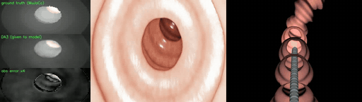
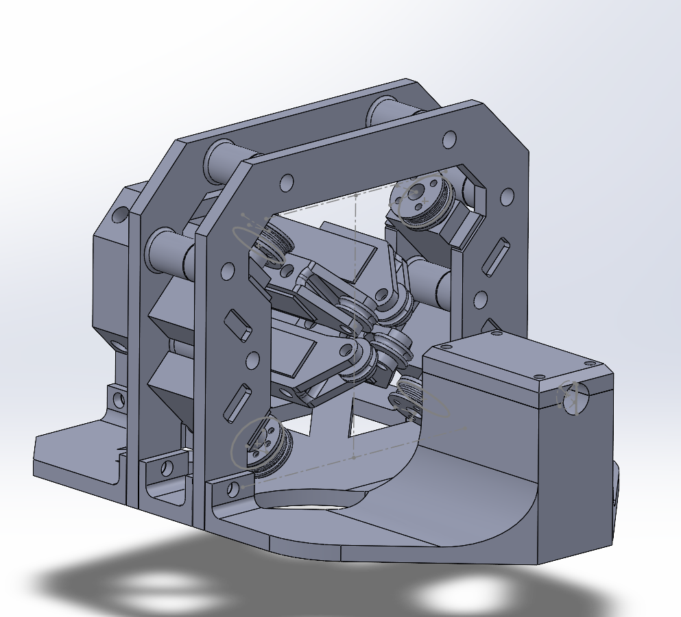

https://github.com/user-attachments/assets/309c087c-117a-41e7-99f0-b1bf73bae10e

# Autonomous Colonoscope Navigation

**A reinforcement learning system that drives a flexible endoscope through a colon on its own,
using nothing but the view from its own tip camera.**

*The full closed loop — one episode, ~30 s, no cuts. The trained policy steers itself through a
procedurally generated colon on nothing but what it can see.
**Left:** ground-truth depth, the DA3 depth estimate the policy is actually given, and the error
between them. **Centre:** the tip camera (a Blender render of the colon mesh). **Right:** a
third-person view of the 44-link flexible shaft bending and buckling against the wall as it is
pushed in. Perception runs on a Windows GPU; the policy checkpoint runs in WSL2. Nothing is
privileged and nothing is scripted.*

Click the clip for the full-resolution 30 s video — [`closedloop_nav_demo_30s.mp4`](docs/media/closedloop_nav_demo_30s.mp4) (H.264, 3 MB).

---

## What this is

Colonoscopy is hard to automate because the scope is a floppy tube: you push at one end and the
tip goes where the anatomy lets it. This project trains a policy to do the whole job in
simulation — steer the articulating tip **and** decide how fast to insert — from a monocular
depth image and a handful of proprioceptive scalars. No trajectory is prescribed and the
policy is never told where the lumen is; it has to infer that from what it can see.

The simulator models the scope as a real physical object: a 44-link flexible shaft fed by an
entrance roller mechanism, with a 25-hinge tendon-driven tip. Push force has to travel around
bends through wall contact, so **buckling, slip and getting stuck are genuine failure modes**
rather than things the model is protected from.

Every design decision is constrained by one rule: **the policy may only observe signals a real
rig can actually supply.** There is no force, tension, motor-current or ground-truth pose
anywhere in the observation.

| | |
|---|---|
| **Sees** | one 54×96 depth image (16:9, 100° horizontal FOV) + 6 scalars — the policy's own previous action, its internal filter state, and a binary tip-contact flag |
| **Does** | 3 continuous outputs in [-1, 1] — two cable-pair bend setpoints and one insertion feed rate |
| **At** | 25 Hz, matching the deployment rate the real depth model can sustain |
| **Trained by** | recurrent PPO (Sample Factory APPO) on procedurally generated colons |

---

## Status

**In real-hardware bring-up.** Simulation work is complete for this phase; the next milestone is
a physical rig trial. Current plan and open questions:
[docs/CURRENT_PLAN.md](docs/CURRENT_PLAN.md).

*The tendon drive rig — four cables to two antagonistic pairs, driven by serial bus servos, with
a cantilever load cell on the shaft axis. [Open it in interactive 3D](hardware/cad/Full%20assem.STL).*

| Result | Value | Evidence |
|---|---|---|
| **v8_p1** (live line — physical shaft, 25 Hz, hardware-matching observation) | ~97% mean progress @ 4.52M steps | ⚠️ *training* statistic from sampled rollouts — **no evaluation run yet** |
| **v6_dr** (frozen milestone — kinematic base advance) | **93.75% completion, 96.7% mean progress** | benchmarked over 80 seeds × 5 episodes, [eval CSV included](navigation/v6_dr/runs_sf/v6_dr_700V3/) |
| Depth model (DA3-SMALL, fine-tuned) | 1.43 mm scale-aligned val MAE, vs 8.30 mm zero-shot | ⚠️ output is **scale-relative, not metric** — this is not a distance accuracy you can obtain at deploy |
| Depth throughput on the real camera | 31 fps / 32.18 ms | measured, `perception/realtime/bench_da3.py` |

The two lines are not directly comparable: v6_dr moved the scope base kinematically, while
v8_p1 has to physically push a flexible shaft. The completion metric also changed on
2026-07-13. **Mean progress is the honest axis** across versions.

---

## Where to go next

| If you want to know… | Read |
|---|---|
| How the whole system fits together | [docs/architecture.md](docs/architecture.md) — the three pipelines, the control loop, the network, the sim-to-real bridge |
| Every constant, traceable to a line of code | [docs/CONTROL_LOOP_REPORT_2026-08-05.md](docs/CONTROL_LOOP_REPORT_2026-08-05.md) |
| Why it is built this way, and what failed first | [docs/ITERATION_HISTORY.md](docs/ITERATION_HISTORY.md) — v1 → v8_p1, including the dead ends |
| The physical rig and what has to be measured | [hardware/README.md](hardware/README.md) — and [the assembly in interactive 3D](hardware/cad/Full%20assem.STL) |
| What happens next | [docs/CURRENT_PLAN.md](docs/CURRENT_PLAN.md) |
| Which RL version is which | [navigation/README.md](navigation/README.md) |
| How to run any of it | [docs/DEV_SETUP.md](docs/DEV_SETUP.md) |
| Everything else | [docs/README.md](docs/README.md) — full documentation index |

---

## Repository map

| Folder | What it is |
|---|---|
| `navigation/` | The RL system — environment, training, evaluation. Three lines: `v8_p1/` (**live**), `v7_shaft/` (superseded), `v6_dr/` (frozen milestone). See [navigation/README.md](navigation/README.md). |
| `perception/` | Monocular depth. `rd_v2/` is the DA3-SMALL fine-tune pipeline and error-map generator; `realtime/` is the live deployment runtime and camera tooling. |
| `simulation/` | Reference videoscope tip model. The navigation bundles carry their own copies by design. |
| `hardware/` | The physical rig — CAD, firmware, and bring-up measurements. See [hardware/README.md](hardware/README.md). |
| `docs/` | Documentation, iteration history, and archived training runs. |

Trained checkpoints are **not** in this repository — they exceed GitHub's file size limit and
are distributed as Release assets. `scenes/` folders are generated output and are always
regenerable.

---

## Attribution

The videoscope tip simulation (`generate_videoscope_one_section.py`, `new8.stl`) and the Blender
dataset-generation scripts used for depth fine-tuning were **provided by a research supervisor**,
and `colon_generator.py` is a port of the supervisor's generator. The navigation environment,
collision and contact modelling, reward design, domain randomisation, depth fine-tuning, the
sim-to-real error-map method, and all RL work are the author's own.

Licensed under the MIT License — see [LICENSE](LICENSE).
