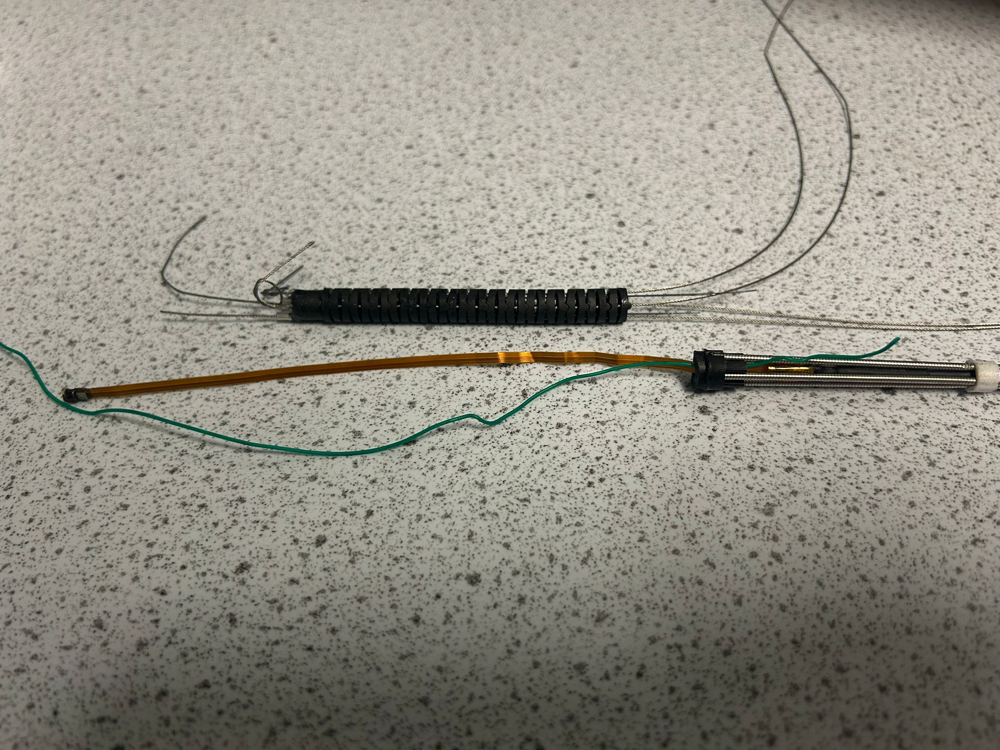
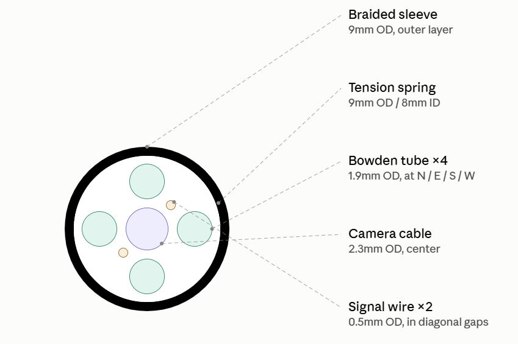
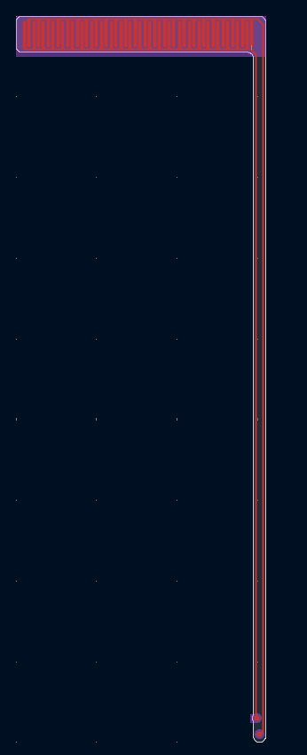

# hardware/ — the physical rig

The real scope, the mechanism that drives it, and the measurements that decide whether the
trained policy transfers. This is where the project is now: simulation work for this phase is
complete and the next milestone is a physical rig trial.

> **⚠️ Work in progress.** The rig is still being built and nothing has been trialled yet.
> Insertion is **hand-fed for now** — the automatic feed drive is not built. The first
> policy-driven tests will run without it: the shaft is pushed in by hand so the **steering
> response** can be checked on its own before the feed mechanism is added.

*Two stages of the bending tip during assembly. Top: a bare articulating disk stack. Bottom: a
wired tip section — the flat orange ribbon is the camera cable, the four fine cables are the
steering tendons, and the coiled section is the tension spring. (The flex tip-contact sensor is
not fitted in this shot.)*

<table>
<tr>
<td></td>
<td></td>
</tr>
</table>

*Left: the tip-to-shaft internals — the full shaft assembly end to end with the flexible spring
and braided housing removed. Right: the shaft cross-section — four tendon Bowden tubes at
N / E / S / W, the camera cable down the centre, and the two flex-sensor signal wires in the
diagonal gaps, all inside a tension spring and a braided sleeve. The tension spring provides a cylindrical shape and compression ridgitiy, and the braided sleeve provides the torsional ridgity to transmit rotation from the base to the tip. From testing the shaft internals provide enough bending resistance to stop buckling whilst still being flexible enough to navigate tight bends*

| Folder | What goes in it |
|---|---|
| [`cad/`](cad/) | SolidWorks sources for the scope, feeder and mounting, plus [`Full assem.STL`](cad/Full%20assem.STL) — **click it on GitHub for an interactive 3D view of the rig** |
| [`firmware/`](firmware/) | Arduino / microcontroller code driving the tendon motors and feed rollers |
| [`electronics/`](electronics/) | Flex PCBs. So far [`flex_tip_sensor/`](electronics/flex_tip_sensor/) — the tip-contact sensor (fabricated, not yet calibrated) |
| [`bringup/`](bringup/) | Test procedures, measurement scripts, and recorded results |

**Live camera and depth tooling is not here** — it lives in `perception/realtime/`
(`probe_camera.py`, `preview_camera_depth.py`, `bench_da3.py`). The dividing line: code that
processes images belongs to `perception/`, code that commands motors or reads encoders belongs
here. Procedures that exercise both go in `bringup/`.

---

## What the rig has to provide

These are requirements the simulator imposes, derived in
[`../docs/CONTROL_LOOP_REPORT_2026-08-05.md`](../docs/CONTROL_LOOP_REPORT_2026-08-05.md) §8.
Nothing here describes measured hardware behaviour.

| | Requirement |
|---|---|
| **Rate** | one decision per 40 ms (25 Hz) |
| **Camera** | 16:9 frame; the policy was trained on 100° horizontal rectilinear |
| **Tendons** | 4 cables in 2 antagonistic pairs, **pull-only**, position-commanded to an absolute pull in mm |
| **Feed** | signed insertion rate, ±30 mm/s at full command — **hand-fed for now**, so `a[2]` is an operator advance/hold/withdraw cue, not yet a driven axis |
| **Contact** | a binary tip-contact flag — the only exogenous signal in the state vector besides the image. Hardware: [`electronics/flex_tip_sensor/`](electronics/flex_tip_sensor/), fabricated but not yet calibrated |
| **Software state** | the PD command shaper and previous-action echo must be **reproduced in software**, not measured — five of the six state floats are internal, not sensors |

---

## Status

**Not yet trialled.** Bring-up is in progress; see [`bringup/`](bringup/) for the pre-flight
measurements that have to happen before the first policy-driven run, and
[`../docs/CURRENT_PLAN.md`](../docs/CURRENT_PLAN.md) §7 for the authoritative sequencing.

The **tip-contact sensor now exists in hardware** — a polyimide flex electrode with a
piezoresistive film, [`electronics/flex_tip_sensor/`](electronics/flex_tip_sensor/) — but it is
uncalibrated and not yet wired in, so it does not change the status above.

*Flex sensor PCB — comb head, 1.5 mm pigtail, solder pads. [Details](electronics/flex_tip_sensor/).*

Three sim-to-real gaps are known and quantified:

1. **Lens distortion.** The real camera is a **122° horizontal fisheye**; the pipeline was built
   on 100° horizontal rectilinear. Fix is perception-side only (measure `K`/`D`, then a
   precomputed `cv2.fisheye` undistort LUT applied before DA3) and is not a retrain blocker.
2. **`MAX_PULL_X` / `MAX_PULL_Z` are sim-derived** (6.795 / 7.361 mm). They normalise two of the
   six live policy inputs, so measuring them on the real scope is a correctness requirement, not
   an improvement.
3. **Camera roll offset is unmeasured.** In sim the tip camera is body-fixed and never rotates,
   so the image↔cable relationship is a constant. On the real scope that constant is unknown.
