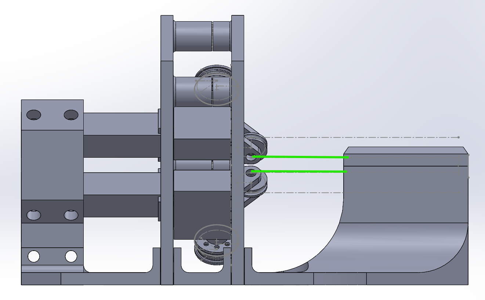
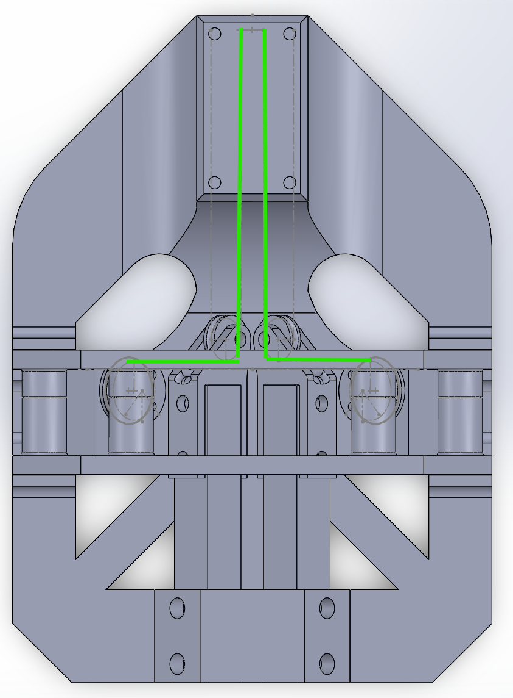

# hardware/cad/

The physical rig: tendon drive, spools, shaft clamp and cantilever force mount. Roughly
180 × 130 × 110 mm.

**[▶ View the assembly in 3D](Full%20assem.STL)** — GitHub renders it interactively; rotate and
zoom in the browser, no software needed.

## Cable routing

Each tendon leaves its spool, turns over a pulley, and runs forward into the shaft clamp on the
scope axis. **The green lines are the drawn cable paths** — construction geometry, not parts.

| | |
|---|---|
|  |  |
| **Side** — cables leave the pulleys and run horizontally into the clamp | **Top** — the pair turns through 90° over the pulleys and into the shaft channel |

## Shaft clamp

The clamp at the scope end is designed for a **9–10 mm OD shaft** carrying **four antagonistic
tendon cables** — the same arrangement the simulated scope uses, so the drive geometry here and
the tendon model in `navigation/` describe the same mechanism.

## Bought-in components

Three parts here are **off-the-shelf, not my design.** They are included because the surrounding
parts were designed around them — their mounting patterns, envelopes and load paths set the
geometry of everything they touch:

| Part | What it is | Designed around it |
|---|---|---|
| `sts3032.SLDPRT` | STS3032 serial bus servo | `sts3032 Bracket male` / `Bracket Female`, the mounting pair that carries it |
| `Load cell block.SLDPRT` | cantilever force bar (load cell) | `Cantilever bracket`, which fixes it and sets the measuring axis |
| `bearing wheel.SLDPRT` | bearing | the pulley and spool assemblies that run on it |

Everything else is my own: the spool, pulley, shaft clamp and clamp top.

## Files

| File | |
|---|---|
| `Full assem.SLDASM` | the complete assembly |
| `Layout Assembely.SLDASM` | layout assembly, shares parts with the above |
| `Full assem.STL` | merged mesh of the whole rig — for viewing, not for printing |
| 10 × `.SLDPRT` | the individual parts |

Flat folder by design: SolidWorks resolves references between files in the same directory with
no path rewriting, so the assembly opens correctly straight from here.

Print-ready geometry is not kept here — open the assembly and export what you need.

---

*Working copy lives outside the repo; see [DEV_SETUP.md](../../docs/DEV_SETUP.md) for how this
folder is refreshed after a design change.*
